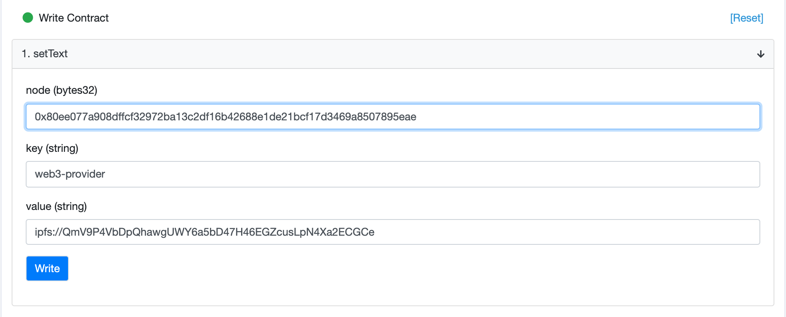

# ENS Login SDK

ENS Login SDK allows you to integrate ENS Login into your Dapp

## Installation

```
yarn add @enslogin/sdk
```

## Setting up on your Dapp

```
import ENSLoginSDK from '@enslogin/sdk/dist/ENSLoginSDK'
const config = {
	provider:
	{ network: 'goerli' },
	ipfs:{
		host: 'ipfs.infura.io',
		port: 5001,
		protocol: 'https',
	}
}

ENSLoginSDK.connect(username, config).then((provider)=>{
    window.ethereum = provider
    window.web3 = new Web3(provider)
    provider.enable()  
})
```

## Setting up provider into your ENS name

Until ENS manager supports arbitrary text record, please update `web3-provider` field via etherscan.
You can get the labelhash of your node via this [pastebin](http://requirebin.com/?gist=c1f2c987dc45a6cbb65b9f1040eff5c4)



### Supported networks

- Goerli, Rinkeby, Ropsten

### Supported providers

- You can find out the list of providers from [`enslogin.eth`](https://app.ens.domains/name/enslogin.eth/subdomains)


## Config params

### Provider (mandatory)

- network

### IPFS (optional) 

- host (default = ipfs.infura.io)
- port (default = 5001)
- protocol (default = https)